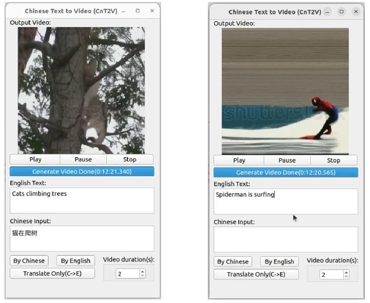
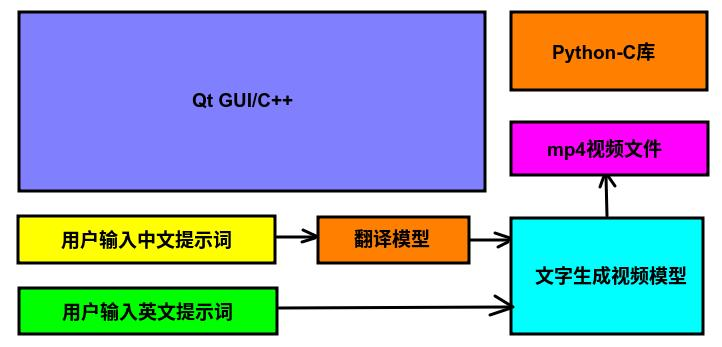

# CnT2V(中文文字生成视频)
## 1、运行效果



## 2、编译环境搭建

### 2.1、操作系统与硬件要求

操作系统：Ubuntu 22

硬件平台：Intel酷睿或者志强，支持AVX指令集，内存16GB以上

注意：本代码默认使用Python3.10版本，如果使用其他版本的Python，请修改CnT2V.pro文件中的包含目录

### 2.2、软件依赖安装

基本的软件依赖

```shell
sudo -E apt-get install gcc g++ make git vim build-essential git-lfs
```

安装python3

```shell
sudo -E apt-get install python python3 python3-pip
sudo -E pip3 install --upgrade pip
```

AI相关依赖

```shell
sudo -E pip3 install --upgrade diffusers transformers accelerate torch
```

安装多媒体依赖

```shell
sudo -E apt-get install gstreamer1.0-libav
```


### 2.3、模型下载

首先是中文到英文的翻译模型

模型位置：https://huggingface.co/Helsinki-NLP/opus-mt-zh-en

保存到的本地代码路径位置：./opus-mt-zh-en

下载命令

```shell
#!/bin/bash
git lfs install
git clone https://huggingface.co/Helsinki-NLP/opus-mt-zh-en
```

或者

```shell
#!/bin/bash
export HF_ENDPOINT=https://hf-mirror.com
huggingface-cli download --resume-download --local-dir-use-symlinks False Helsinki-NLP/opus-mt-zh-en --local-dir opus-mt-zh-en
```


然后是文字生成视频的模型

模型位置：https://huggingface.co/ali-vilab/text-to-video-ms-1.7b

保存到的本地代码路径位置：./text-to-video-ms-1.7b

下载命令

```shell
#!/bin/bash
git lfs install
git clone https://huggingface.co/ali-vilab/text-to-video-ms-1.7b
```

或者

```shell
#!/bin/bash
export HF_ENDPOINT=https://hf-mirror.com
huggingface-cli download --resume-download --local-dir-use-symlinks False ali-vilab/text-to-video-ms-1.7b --local-dir text-to-video-ms-1.7b
```


### 2.4、环境验证

翻译模型的验证，执行下面脚本后，会输出【猫在爬树】的英文翻译。

```shell
./test_tsl.py
```

文字生成视频模型的验证，执行下面脚本后，会输出蜘蛛侠在冲浪的相关视频，并保存为test.mp4文件。

```shell
./test_ttv.py
```


### 2.5、Qt安装和编译

我这里使用的是qt5.13.2的linux安装包，可以从下面的地址下载

https://download.qt.io/new_archive/qt/5.13/5.13.2/qt-opensource-linux-x64-5.13.2.run

下载完成后，给该文件增加可执行权限

```shell
chmod +x qt-opensource-linux-x64-5.13.2.run
```

然后按照界面的提示一步一步安装即可，详细安装过程可以参考下面的演示视频

然后编译的话只要用Qt Creator打开我们源码中的CnT2V.pro工程即可

## 3、使用Intel的硬件平台加速

​    本代码中使用DiffusionPipeline，并调用torch，当部署在intel的硬件平台上时，会自动调用CPU的AVX指令集进行加速处理。

## 4、方案与原理

### 4.1、概述

​    本开源软件应用领域广泛，对于2秒左右的超短视频，通常可以做成表情包，用户只需要输入少量文字描述，在等待片刻后，就会自动生成相关的视频。然后拿到原始的mp4视频文件后，通过第三方的视频处理软件转换为git动图就可以轻松制作表情包。

​    除了超短视频以外，该软件也可以自定义时长生成视频。比如自定义10秒、50秒，甚至200秒。当然，随着视频时间变长，它的生成耗时也会变长。用户可以根据需要自行调整。

​    除了应用广泛以外，本软件最大的特点是开源，并且完全本地离线运行，保证了用户的隐私和数据安全。在Intel强大硬件的加速下，可以高效快速的响应用户的需求。并且基于Qt+Python开发，可以方便移植到各种嵌入式平台中，提高产品的人机交互体验。

​    该软件的整体思想是利用Qt制作UI界面，然后采用原生Python-C的库调用DiffusionPipeline的接口，从而使用本地的text-to-video-ms-1.7b模型。当前您也可以根据自己的需要更换自己喜欢的自定义模型。目前国内文字生成视频的AIGC软件较少，而且现有的其他类型软件几乎都是需要联网才能实现类似的功能。而本软件无需联网，让您的数据更加安全，让您与软件交互的数据更加隐私。同时，本软件完全开源，内部所有代码尽收眼底，无需担心会有隐匿的窃取用户信息等行为。

### 4.2、使用模型

https://huggingface.co/Helsinki-NLP/opus-mt-zh-en

https://huggingface.co/ali-vilab/text-to-video-ms-1.7b

### 4.3、工作流与软件结构



​    软件的结构和流程如上图所示，软件最底层是2个模型，其中文字生成视频的部分是通过Python调用DiffusionPipeline的diffusers。然后中文到英文的翻译模型是调用AutoModelForSeq2SeqLM的transformers。然后使用原生的Python-C的库通过CPyAI类进行封装。然后上层是Qt做的GUI，主要由CQtAI类进行对下层的接口抽象和分离。

​    当用户输入中文提示词的时候，中文文字先经过翻译模型转换为英文后，再将英文结果送入文字生成视频的模型。然后会将生成的模型保存成mp4视频文件，然后由Qt的GUI载入并播放该视频。当用户输入的提示词为英文的时候，就省去了中间的翻译过程，而直接将用户的提示词送入文字生成视频的模型中。


## 5、演示视频

【中文文字生成视频开源项目(可本地离线运行)-哔哩哔哩】 https://b23.tv/UJEfN6W

## 6、联系方式

邮箱：rainhenry@savelife-tech.com

## 7、许可证

本代码采用GPLv3许可证 https://www.gnu.org/licenses/gpl-3.0.en.html
